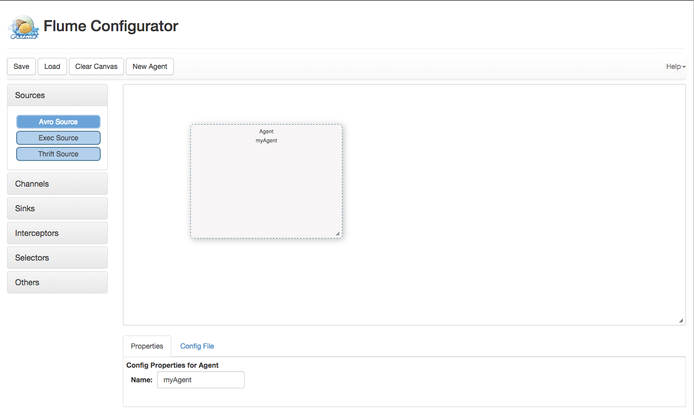

<h1>FlumeConfig</h1>
<h2>A Visual Flume Editor</h2>

<p>
Version: 0.1.0
Flume config is written entirely in Javascript and is self contained.  It allows you to visually layout a Flume topology, enter properties for the sources, channels, and sinks, and creates the flume config file for you.
It can handle multiple agents.  At this time not all sources, sinks, channels are available, but that is coming VERY soon.
</p>
<p>
<b>Prerequisites</b>
If you want to use the embedded server you will need to have node.js installed.  Otherwise you can drop this into the appserver of your choice.
</p>
<p>
<b>To Run:</b>
```bash
grunt build
cd  app
node server.js
```

You can also run it in developer mode via:
```bash
grunt serve
```
</p>
<p>
<b>To Use</b>

<br/>
<ol>
<li/>Select a Node Type (Source, Sink, Channle, etc) from the left hand side
<li/>Double Click on the agent to add the node ot the agent
<li/>Select the node and eneter the properties in the propoerties tab at bottom
<li/>Add another node and drag and drop a connection form one node to another
<li/>Enter properties for that node
<li/>Select the &quot;Config File&quot; tab to view the resulting flume cocnfig file
<li/>Copy the text and use as you would normally for Flume
</ol>

**To-Do:**
<ol>
<li/>Finish creating json files for all sources, channels, sinks, etc.
<li/>Tooltips
<li/>Implement Saving and Loading of Configs -- Either locally or implement persistence
<li/>Better mechanism for deletion of node connections
<li/>Integrate into Ambari
<li/>Better Node Graphics on Left Accordians
<li/>Testing, testing, testing
</ol>
</p>